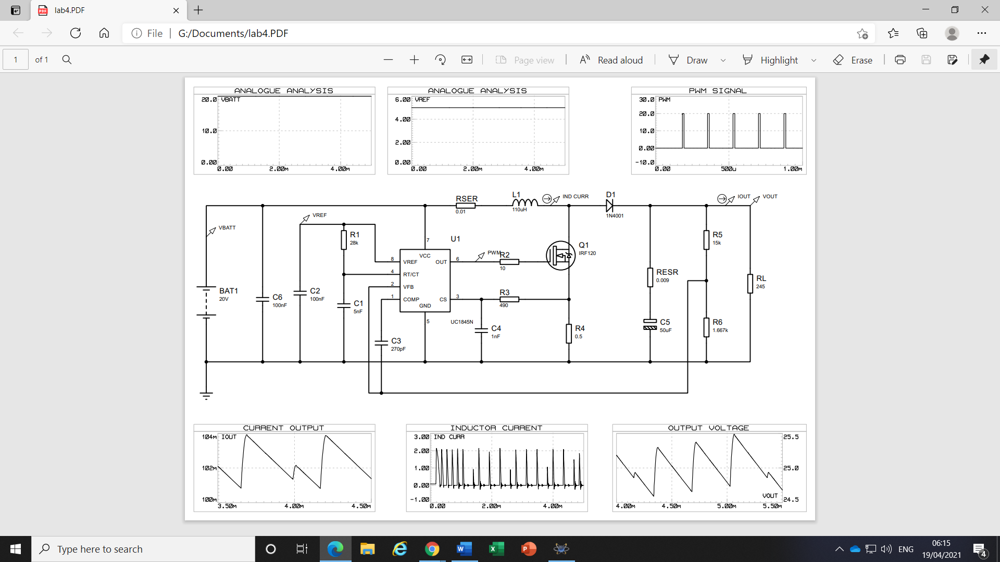
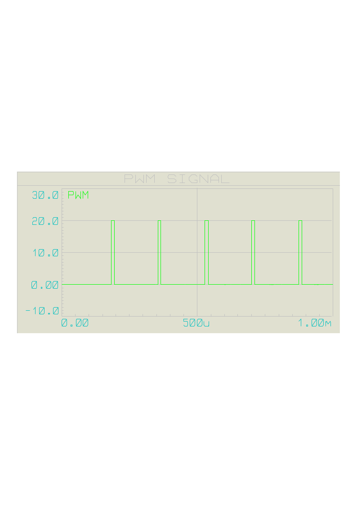
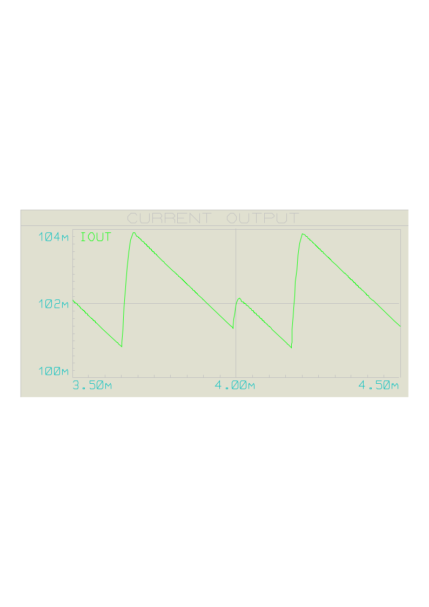
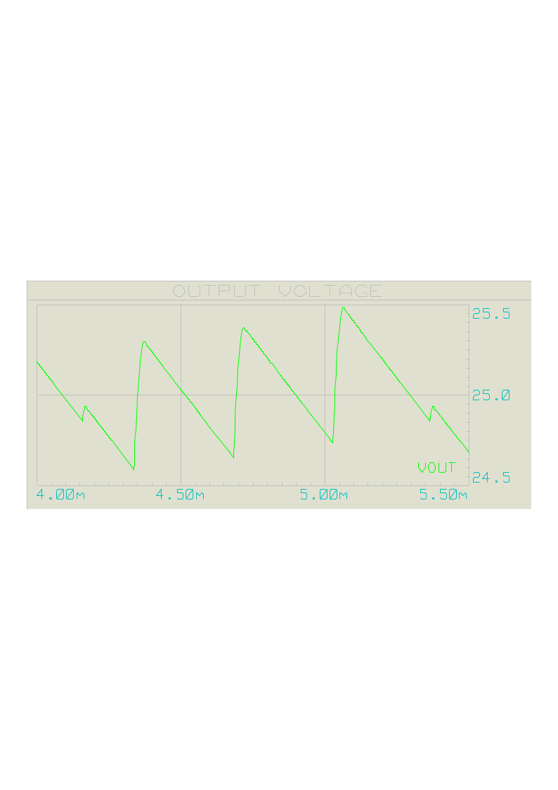
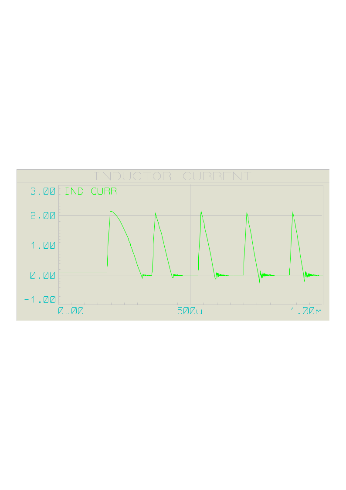
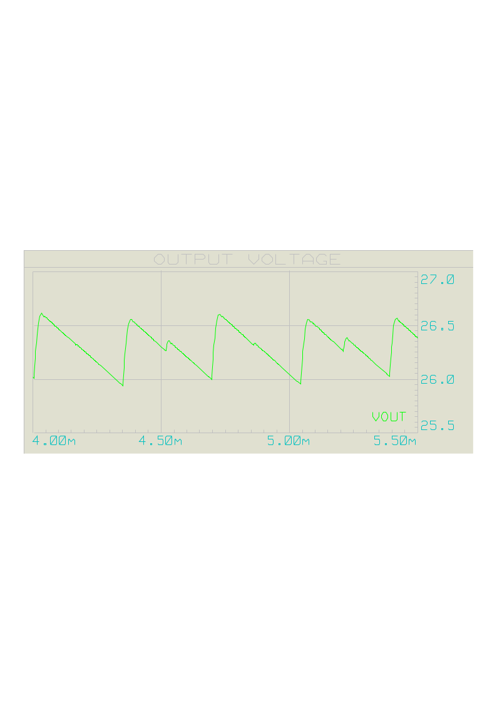

# Closed Loop PWM Controller Lab Report

## Objective
To implement and analyze a closed-loop PWM controller for a DC-DC converter in order to maintain a constant output voltage under varying load conditions.

## Theory
Closed-loop PWM control uses output-voltage feedback to dynamically adjust the duty cycle of the converter.

- Controller type: PI/PID
- Duty cycle relationship: `D(t) = Kp * e(t) + Ki * ∫e(t) dt`

## Circuit Diagram

## PWM Signal

## Output Current

## Output Voltage

## Inductor Current

## Output Voltage After 5% Increase

## Calculations and Measured Results

### Case 1: R1 = 28 kΩ
Measured from simulation:
- PWM period, T = 173 µs
- Switching frequency, f = 5.78 kHz
- TON = 11 µs
- Duty cycle = TON / T = 11 / 173 = 0.0636 = 6.36%
- Output voltage ripple = 0.8 V
- Output current ripple = 3 mA
- Inductor current ripple = 2.13 A

Calculated values:
- Oscillator frequency = 12.29 kHz
- Switching frequency = 6.145 kHz
- Period, T = 162.7 µs

### Measured vs Calculated
| Parameter | Measured | Calculated | Error |
|---|---:|---:|---:|
| Switching frequency | 5.78 kHz | 6.145 kHz | 6.31% |
| PWM period | 173 µs | 162.7 µs | 5.9% |
| Inductor current ripple | 2.13 A | 2.00 A | 6.1% |
| Output voltage ripple | 0.8 V | 0.406 V | 97% |

### Effect of changing R1

#### R1 = 50 kΩ
- PWM period, T = 306 µs
- TON = 11 µs
- Duty cycle = 11 / 306 = 0.0359 = 3.59%
- Calculated switching frequency = 3.44 kHz
- Calculated period = 290.698 µs
- Output voltage ripple = 0.8 V
- Output current ripple = 3 mA
- Inductor current ripple = 2.139 A

#### R1 = 10 kΩ
- PWM period, T = 63 µs
- TON = 11 µs
- Duty cycle = 11 / 63 = 0.175 = 17.5%
- Calculated switching frequency = 17.2 kHz
- Calculated period = 58.14 µs
- Output voltage ripple = 0.7 V
- Output current ripple = 3 mA
- Inductor current ripple = 2.14 A

### Output Voltage Increase by Resistor Adjustment
To increase the output voltage by 5%, the feedback voltage-divider resistors were adjusted.

- VOFFSET = 2.5 V
- Measured output voltage before change = 25 V
- Target output voltage after 5% increase = 26.25 V
- Selected resistor: RCSF = 3 kΩ
- Calculated resistor: RP = 28.5 kΩ

Using 3 kΩ and 28.5 kΩ in the voltage divider increased the output voltage to 26.25 V.

## Key Outcome
The controller maintained the desired 12 V output with low ripple and fast settling time under changing load conditions.

## Repository Contents
- `Report.md` – project documentation
- `Figures/` – circuit and simulation screenshots
- `MATLAB_Simulink_Files/` – simulation files
- `Proteus_Files/` – Proteus implementation

## Applications
This project is relevant to:
- DC-DC converter control
- closed-loop control systems
- power electronics
- voltage regulation
- embedded control and automation

## Author
Disha Harwalkar
