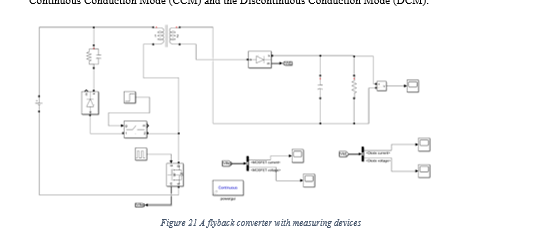
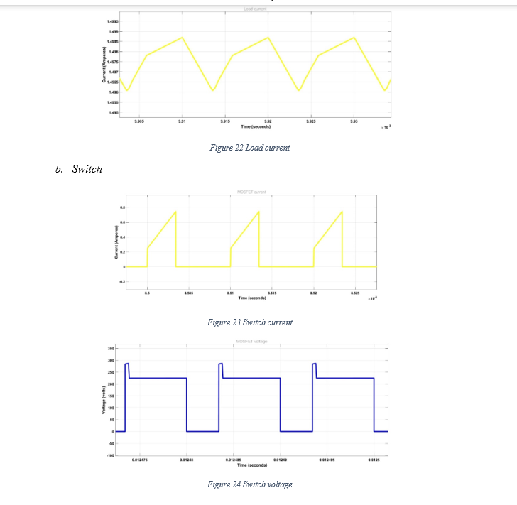
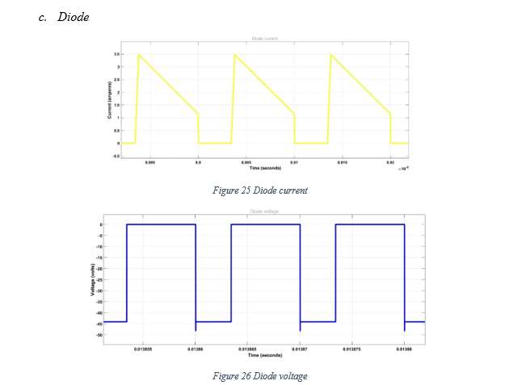
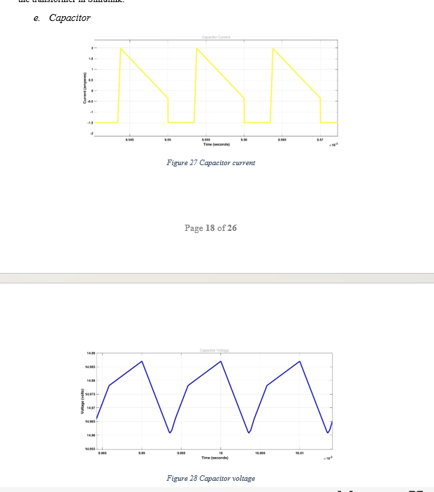
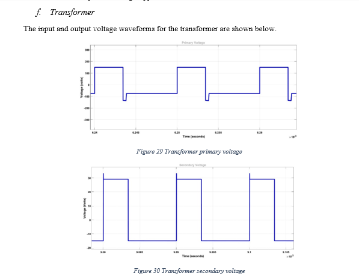

# Flyback Converter

## Objective
To study the operation and waveform behavior of a flyback converter used for isolated DC-DC power conversion.

## Overview
A flyback converter is an isolated switch-mode DC-DC converter. It stores energy in the transformer during the switch ON period and transfers that energy to the output during the switch OFF period.

## Key Concepts
- isolated power conversion
- transformer-based energy transfer
- switch-mode operation
- voltage conversion using duty cycle and turns ratio

## Basic Relation
The output voltage of a flyback converter depends on the input voltage, duty cycle, and transformer turns ratio.

`Vout = (D / (1 - D)) × (Ns / Np) × Vin`

Where:
- `D` = duty cycle
- `Ns` = secondary turns
- `Np` = primary turns
- `Vin` = input voltage

## Simulation Model and Waveforms

### Circuit Diagram and Load Current

### Switch Current and Switch Voltage

### Diode Current and Diode Voltage

### Capacitor Current and Capacitor Voltage

### Transformer Primary and Secondary Voltage

## Observations
- The flyback converter circuit was modeled with measuring devices to observe voltage and current waveforms.
- The load current waveform shows periodic variation under switching operation.
- The MOSFET switch current rises during the ON interval, while the switch voltage changes according to the switching state.
- The diode conducts during the energy transfer interval and its voltage changes accordingly.
- The capacitor current and capacitor voltage waveforms show the output filtering behavior.
- The transformer primary and secondary voltages confirm isolated energy transfer between the two sides.

## Applications
Flyback converters are commonly used in:
- isolated power supplies
- battery chargers
- low-to-medium power SMPS designs
- embedded and industrial electronic systems

## Repository Contents
- `Report.md` – project documentation
- `Figures/` – simulation screenshots and waveform results

## Conclusion
This project helped analyze the operating principle of a flyback converter and understand the voltage and current waveforms of important components such as the switch, diode, capacitor, load, and transformer.
